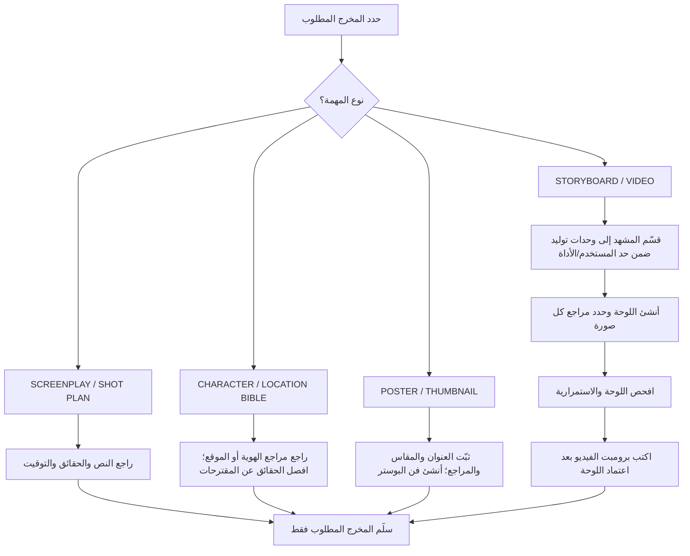

# دليل الاستخدام الشامل لمحرك الإخراج والإنتاج السينمائي الهوليوودي
## AI Video Storyboard & Hollywood Studio Director Master Engine (v8.0)

> ملاحظة v7.0: كل القوالب العامة أصبحت محايدة للمشروع (بلا أسماء أو مخلوقات أو أزياء أو مناخ ثابت). أي اسم أو دب أو باركا حمراء أو ثلج يظهر في مثال موسوم بـ «مثال» هو للتوضيح فقط — استبدله دائمًا بتفاصيل مصدرك المعتمد. مثال `MARWAN SALIM` المحفوظ في `references/examples/` هو عينة لوحة تعريف فقط وليس هوية افتراضية.

---

## الفهرس العام
0. [ابدأ هنا: استدعاء المهارة واختيار نوع المخرج](#ابدأ-هنا-استدعاء-المهارة-واختيار-نوع-المخرج)
1. [مقدمة وفلسفة الإصدار v7.0 (المخرج ومدير التصوير الهوليوودي المتكامل)](#1-مقدمة-وفلسفة-الإصدار-v70)
2. [الهيكل التنظيمي للمشروع والمجلدات الموحدة](#2-الهيكل-التنظيمي-للمشروع-والمجلدات-الموحدة)
3. [الأركان الإنتاجية الـ 15 للمحرك](#3-الأركان-الإنتاجية-الـ-15-للمحرك)
4. [موسوعة العدسات والبصريات السينمائية وعلم الألوان (Hollywood Optics & Kelvin)](#4-موسوعة-العدسات-والبصريات-السينمائية-وعلم-الألوان)
5. [محرك منع الهلوسات والشقلبة وقفل ملامح النضج (Anti-Spin & Anti-De-Aging)](#5-محرك-منع-الهلوسات-والشقلبة-وقفل-ملامح-النضج)
6. [مراجعة صياغة السلامة عند الحاجة](#6-مراجعة-صياغة-السلامة-عند-الحاجة)
7. [خطوط الإنتاج المتخصصة (أفلام، إعلانات AIDA، ريلز فيروسي 9:16)](#7-خطوط-الإنتاج-المتخصصة)
8. [مكونات ملف البرومبت الموحد (`prompts.txt`)](#8-مكونات-ملف-البرومبت-الموحد-promptstxt)
9. [دليل دورة الإنتاج خطوة بخطوة (Step-by-Step Production Protocol)](#9-دليل-دورة-الإنتاج-خطوة-بخطوة)
10. [موسوعة حلول المشاكل والحالات الواقعية (Troubleshooting Guide)](#10-موسوعة-حلول-المشاكل-والحالات-الواقعية)
11. [الأدوات البرمجية والأتمتة السريعة](#11-الأدوات-البرمجية-والأتمتة-السريعة)

---

## ابدأ هنا: استدعاء المهارة واختيار نوع المخرج

استدعِ `ai-video-storyboard` من واجهة المهارات. إذا كانت الواجهة تدعم الاستدعاء بالأمر، اكتب `/ai-video-storyboard` ثم اذكر طلبك مباشرة. لا يحتاج المستخدم إلى ملء نموذج طويل؛ يكفي تحديد المخرج المطلوب. ويمكن كتابة `MODE:` لتوضيح المسار عند الحاجة.

### أمثلة سريعة

```text
/ai-video-storyboard
Create a cinematic poster for THE GUARDIAN PROTOCOL. Write the image prompt in English. Tell me which reference images to upload.
```

```text
/ai-video-storyboard
MODE: STORYBOARD
Build the storyboard prompt in English for Scene 1, Generation G01, 00:00–00:10. Preserve the script and tell me exactly which images to upload.
```

```text
/ai-video-storyboard
MODE: CHARACTER BIBLE
Create an English character-sheet prompt for R-7 using the uploaded robot image as the identity/design reference. Preserve every established design detail.
```

### اختر مخرجًا واحدًا أو حزمة طلبتها صراحةً

| MODE | متى تختاره؟ | المدخلات الأساسية | ما الذي يسلّمه المحرك؟ |
|---|---|---|---|
| `SCREENPLAY / SHOT PLAN` | كتابة أو مراجعة السيناريو والتغطية السينمائية | النص الحالي، الحقائق المعتمدة، مدة الفيلم | النص أو التعديل المطلوب، توقيت المشاهد، حركات الكاميرا، وتقسيم التوليد عند الطلب |
| `STORYBOARD` | تخطيط صورة/لقطة أو تسلسل كامل قبل الفيديو | المشهد، أزمنة التوليد، نسبة العرض، صور الهوية والمكان، وفريم الربط إن وجد | برومبت صورة باللغة المطلوبة، وصف اللوحات وتوقيتها، تدقيق الاستمرارية، وقائمة الصور المطلوب رفعها |
| `CHARACTER BIBLE` | تثبيت هوية شخصية أو روبوت بصريًا | مرجع الشخصية، حقائق السيناريو، التصميم المطلوب | لوحة تعريف مستقلة لكل شخصية، وبرومبت إنجليزي عند الطلب، مع فصل الحقائق عن المقترحات |
| `LOCATION / SET BIBLE` | تثبيت شكل المختبر أو الموقع وجغرافيته | صور الموقع، مخطط أو وصف معتمد، وقت اليوم والإضاءة | لوحة مكان وتحديد المداخل والمحاور والإضاءة واستمرارية الموقع |
| `FILM POSTER / THUMBNAIL` | بوستر تسويقي أو صورة مصغرة | العنوان الحرفي، ملخص الفيلم، الشخصيات والمراجع، المقاس | برومبت فني مستقل عن الستوري بورد؛ نصوص الصورة قصيرة ومحددة |
| `VIDEO PROMPT` | تحويل لوحة مفحوصة إلى تعليمات فيديو | لوحة معتمدة، مدة ملف الفيديو، فريم البداية/الربط، المراجع | برومبت فيديو نهائي مرتبط بحركة اللوحة والاستمرارية والمدة القصوى |
| `PRODUCTION PACKAGE` | أكثر من مخرج في مشروع واحد | قائمة المخرجات وترتيبها | المخرجات المذكورة فقط، بالترتيب المطلوب |

### قواعد مشتركة لكل المخرجات

- حافظ على السيناريو ومرجع الهوية كمصدر للحقيقة. لا تضف حوارًا أو شخصية أو سلاحًا أو حدثًا لمجرد ملء اللوحة. ميّز بين حقيقة النص والاختيار الإنتاجي المقترح.
- افصل بين **مدة المشهد الدرامي** و**مدة ملف التوليد**. يمكن أن يتجاوز المشهد 10 ثوانٍ؛ لا يتجاوز أي ملف توليد حد المستخدم/الأداة، و10 ثوانٍ هو الحد الافتراضي في هذا الدليل. اربط الوحدات المتتابعة بحالة نهاية وبداية متطابقتين.
- اكتب برومبتات الإنتاج ونص الصورة باللغة التي يحددها المستخدم. إذا طلب الإنجليزية، فليكن البرومبت والعبارات المطبوعة داخل الصورة بالإنجليزية؛ اشرح باللغة التي يستخدمها المستخدم.
- سمِّ وظيفة كل مرجع مرفوع: `IDENTITY / DESIGN`, `LOCATION`, `LAYOUT ONLY`, `STYLE ONLY`, أو `START / BRIDGE FRAME`. لا تجعل مرجع تخطيط أو أسلوب يغيّر هوية الشخصية.
- لا تحشر كل التفاصيل داخل حروف اللوحة المصوّرة. اجعل تسميات الصورة قصيرة، وقدّم بقية التفاصيل في البرومبت النصي؛ نماذج الصور قد تخطئ في النصوص الطويلة.
- نفّذ المخرج الذي طلبه المستخدم فقط. لا تفرض عليه ملف `prompts.txt` أو لوحة شخصية أو بوستر أو برومبت فيديو إضافيًا.

## 1. مقدمة وفلسفة الإصدار v7.0

تم تطوير الإصدار **v7.0 (The Hollywood Studio Director & Cinema Engine)** ليحول الوكيل الذكي من مجرد "كاتب نصوص برومبت" إلى **مخرج سينمائي متكامل ومدير تصوير هوليوودي (Virtual Director & DP)**.

يستند هذا الإصدار إلى مبادئ التصوير والاستمرارية الشائعة في نماذج توليد الفيديو، ويساعد على تقليل بعض التعثرات البصرية؛ لكنه لا يضمن نتيجة مطابقة أو قبولًا من منصة بعينها:
1. **القضاء على الشقلبة ودوران الشخصيات (180° Turntable Spins)**.
2. **منع ارتداد ملامح الوجه لطفل (Baby-Face De-Aging Glitch)**.
3. **كسر الجمود الحركي وفخ "المشي البسيط والممل" عبر تفكيك الحركات الميكروية**.
4. **صياغة مشاهد الخطر بوضوح ومسؤولية؛ لا توجد صياغة تضمن تجاوز فلاتر المنصات**.
5. **تطبيق بصريات هوليوود الحقيقية (عدسات آنامورفيك، درجات حرارة كلفن، وإضاءة حجمية)**.

---

## 2. الهيكل التنظيمي للمشروع والمجلدات الموحدة

الشجرة التالية مثال لحزمة إنتاج كاملة فقط؛ لا تُنشأ كل هذه الملفات أو المجلدات عند طلب بوستر واحد أو لوحة واحدة.

```text
C:\motion\ (أو مجلد المشروع الرئيسي)
├── screenplay_master.md              <-- النص الكامل مقسم لمشاهد ومقاطع 10 ثوانٍ
├── character_location_bible.md       <-- الدليل المرجعي لهوية الشخصيات والبيئات
├── storyboard.xlsx                   <-- جدول إكسل الرئيسي لتتبع الفريمات والمقاطع
├── _references/                      <-- الصور المرجعية المعتمدة
│   ├── hero_character_ref.jpg
│   └── environment_mood_ref.jpg
├── Thumbnails_and_Posters/           <-- حزمة التسويق والبوسترات الرسمية
│   ├── Film_Thumbnail_16x9.jpg
│   └── Film_Poster_9x16.jpg
├── Scene01_Segment01_<اسم_المقطع>/
│   ├── bridge_frame.jpg              <-- صورة ربط اختيارية من المقطع السابق عند الحاجة
│   ├── storyboard_sheet.jpg          <-- لوحة الستوري بورد المجمعة (4×3 أو 5+5)
│   ├── prompts.txt                   <-- ملف البرومبت الموحد والشامل (العقد الإلزامي)
│   └── [video_output.mp4]            <-- الفيديو النهائي المولد
└── ...
```

---

## 3. الأركان الإنتاجية الـ 15 للمحرك

### الركن 1: بروتوكول الستوري بورد أولاً (Storyboard-First & Sheet-Driven Architecture)
في مسار الفيديو، تُبنى لوحة التوليد وتُراجع قبل كتابة برومبت الفيديو النهائي. لا ينطبق هذا الترتيب على بوستر مستقل أو لوحة تعريف شخصية/موقع أو مراجعة سيناريو ما لم يطلب المستخدم ذلك.

لوحة وحدة التوليد تغطي ملفًا لا يتجاوز الحد المحدد. أما لوحة التسلسل الأطول فهي خطة لقطات مونتاجية، لا تعني توليد فيديو واحد بطول المشهد؛ اربط كل لقطة بوحدة توليدها وحالة الاستمرارية.

### الركن 2: بند ملء الشاشة الفوري ومنع ظهور الشبكة (Zero-Grid Mandate)
يخص هذا البند **الفيديو الناتج فقط**: يبدأ الفيديو بمشهد حي ملء الشاشة، ولا يعرض لوحة القصة أو إطاراتها. لا يمنع ظهور الشبكة أو التسميات داخل صورة الستوري بورد نفسها:
```text
[CRITICAL ZERO-GRID MANDATE — INSTANT FULL-SCREEN LIVE ACTION AT 0:00S]:
From the very first frame at 0.00 seconds, the video MUST BE 100% FULL-SCREEN LIVE ACTION CINEMA.
STRICT NEGATIVE: ABSOLUTELY DO NOT SHOW THE STORYBOARD SHEET, DO NOT SHOW THE 12-PANEL GRID, DO NOT SHOW WHITE OR BLACK FRAMES/BORDERS, AND DO NOT DISPLAY TEXT CAPTIONS IN THE FIRST SECOND!
```

### الركن 3: هندسة العدسات والبصريات السينمائية (Hollywood Optics & Lenses)
ربط كل لقطة بخصائص بصرية وفيزيائية صارمة (Focal Length, T-Stop, FOV, Anamorphic Bokeh) كما هو مفصل في القسم الرابع.

### الركن 4: محرك منع الشقلبة والدوران (Anti-Hallucination & Zero-Spin Engine)
اختر لقطة مستمرة أحادية الاتجاه أو تغطية مونتاجية بحسب المشهد. حافظ على محور 180 درجة حيث يتطلبه الاستمرار؛ لا تمنع دورانًا طبيعيًا أو عبور محور إذا كان مكتوبًا ومقصودًا.

### الركن 5: قفل الهيكل العظمي وملامح النضج (Anti-De-Aging Adult Face Lock)
استخدمه فقط عندما تكون الشخصية المعتمدة بالغة وعندما يتسبب النموذج في تغيير العمر/الهوية. خذ العمر والبنية من المصدر؛ لا تفترض عمرًا أو جنسًا أو ملامح لأي شخصية.

### الركن 6: مراجعة صياغة السلامة عند الحاجة
راجع قواعد المنصة المستهدفة عند وجود محتوى حساس. لا توجد صياغة تضمن قبول المنصة، ولا تغيّر النبرة أو تمحو أحداث السيناريو تلقائيًا.

### الركن 7: تفكيك الحركة الميكروية الحركية (Biomechanical Micro-Action Staging)
قسّم الحركة إلى بدايتها وتفاعلها ونتيجتها وحالة نهايتها. استخدم نبضات كل ثانيتين عندما تساعد على وضوح الحركة؛ لا تفرض مشيًا أو طقسًا أو فروًا أو حركة جسدية على لقطة ساكنة.

### الركن 8: تدقيق الهندسة الفضائية 1:1 وبوابة إمكانية الوصول (Spatial Geometry Audit & Reachability Gate)
عند وجود لمس أو نقل غرض، دقّق موضع البداية والهدف وإمكانية الوصول وحالة اليد/الغرض قبل الفعل وبعده. استخدم نسبة 15% كمؤشر تقريبي فقط، لا كقانون ثابت لكل عدسة أو تكوين.

### الركن 9: فيزياء التفاعل المسطح ومنع الانقلاب (Planar Interaction Physics)
صف سطح التلامس واتجاه الحركة بدقة عندما تكون هندسة التلامس مهمة. حافظ على محور الكاميرا حيث يلزم، ولا تحظر الالتفاف أو عبور المحور إذا كان جزءًا معتمدًا من الفعل.

### الركن 10: ميكانيكا انتقال الأدوات ومنع التكرار (Prop Anti-Duplication Mechanics)
عند التقاط غرض أو نقله أو استخدامه أو تركه، وضّح من يحمله ومتى تصبح اليد فارغة. تجاوز هذا التدقيق إذا لم يوجد تفاعل مع غرض.

### الركن 11: سببية التشريح الميكانيكي رباعية الخطوات (4-Step Mechanical Causality)
عند إخراج غرض من جيب أو حقيبة، اذكر الخطوات الضرورية بالترتيب (الوصول، الفتح، الإمساك، الإخراج) وحافظ على حالته. لا تفرض هذا التسلسل على أفعال أخرى.

### الركن 12: شبكات الستوري بورد حسب أبعاد العرض (Aspect-Ratio-Aware Grids)
- شاشات السينما واليوتيوب (16:9): شبكة 4×3 تضم 10 لوحات سينمائية + كلاكيت الصوت + كلاكيت تدقيق المخرج.
- منصات التواصل العمودية (9:16): لوحتان مجمعتان بنظام (5+5) عمودي بدقة كاملة.

### الركن 13: خطوط الإنتاج المتخصصة المتعددة (Multi-Domain Production Pipelines)
تخصيص قواعد الإنتاج لكل مجال: الأفلام الدرامية، الإعلانات التجارية الفاخرة (AIDA)، وريلز السوشيال ميديا الفيروسي.

### الركن 14: بروتوكول إطار الربط المزدوج المتسلسل (Dual Bridge Frame Protocol)
عند وجود توليد متصل، احفظ آخر فريم مستخدم من الوحدة السابقة كبداية مرجعية للوحدة التالية، مع بيان موضع القص إذا لم تكن الوحدة كاملة 10 ثوانٍ. المطابقة تساعد على الاستمرارية لكنها لا تضمن انعدام القفزات.

### الركن 15: حزمة التسويق السينمائي والتوزيع (Cinematic Marketing & Studio Distribution)
إنشاء بوستر أو صورة مصغرة 16:9 أو 9:16 عند طلبها، مع عنوان ونصوص معتمدة فقط. البوستر مخرج مستقل ولا يتطلب سيناريو ستوري بورد.

---

## 4. موسوعة العدسات والبصريات السينمائية وعلم الألوان

هذه قيم مرجعية لا وصفة إلزامية. اختر جسم الكاميرا والعدسة وفتحة العدسة فقط إذا حسّنت وضوح اللقطة أو طلب المستخدم واقعية تقنية محددة:

| نوع اللقطة السينمائية | البعد البؤري وفتحة العدسة | زاوية الرؤية (FOV) | عمق المجال (DOF) والبوكيه | الاستخدام الإخراجي الأمثل |
| :--- | :--- | :--- | :--- | :--- |
| **Master Establishing Shot** | 24mm Anamorphic T2.0 | واسعة جداً (~84°) | عمق مجال شاسع (Deep Focus)، أفق مستقيم مع تشوه حواف طفيف | اللقطات التأسيسية، إظهار البيئة الشاسعة والطقس القاسي |
| **Narrative Two-Shot / Action** | 35mm – 50mm Anamorphic T2.8 | طبيعية (~45°–60°) | عمق مجال متوسط واقعي يماثل منظور العين البشرية | تتبع المشي المشترك، صراع الشخصيات، التفاعل البيئي |
| **Emotional Close-Up / MCU** | 85mm T1.4 High-Speed | ضيقة (~28°) | عمق مجال ضحل جداً (Shallow DOF)، بوكيه بيضاوي حريري | عزل تعابير الوجه، تفاصيل النظرات، تصاعد بخار الأنفاس |
| **Tactile Macro Insert** | 100mm Macro 1:1 T2.8 | ضيقة مركزة (~24°) | تركيز فائق على السطح، عزل تام للخلفية | انغراس قفاز في الفرو، مسك الأداة، سحب السحاب، تفاصيل المنتج |

### أمثلة مرجعية لدرجات حرارة الألوان والإضاءة الحجمية (Kelvin & Lighting Science):
القيم التالية أمثلة من مشروع سابق؛ اختر ألوانًا تناسب المشهد الحالي ولا تنقل الطابع القطبي تلقائيًا.
- **7500K – 8500K (Polar Steel-Blue Twilight):** أجواء الشفق القطبي والعواصف الجليدية؛ ضوء فولاذي بارد خالٍ من أي اصفرار.
- **10000K (Luminous Sapphire Ice Glow):** إضاءة الكهوف والبلورات الجليدية الياقوتية المتوهجة بنقاء سيان/أزرق نيون طبيعي.
- **5600K (Balanced Daylight):** ضوء النهار الطبيعي المتوازن للمشاهد الخارجية الصافية.
- **3200K (Warm Tungsten / Firelight):** شعلة النار، المخيمات، والإضاءة الداخلية الدافئة.
- **الإضاءة الحجمية (Volumetric Tyndall Scattering):** أشعة الضوء المتغلغلة عبر رذاذ الثلج أو الضباب، مع تفعيل التناثر تحت السطحي (Subsurface Scattering) لجلد الممثلين وفرو الحيوانات.

---

## 5. محرك منع الهلوسات والشقلبة وقفل ملامح النضج

### تشخيص مشكلة الشقلبة (180° Turntable Spin):
تحدث الشقلبة عندما يبدأ المشهد من لقطة خلفية (ظهور الشخصيات للكاميرا)، ثم يطلب البرومبت لقطات أمامية للوجه؛ هنا يعجز نموذج الفيديو عن تدوير الكاميرا في فضاء ثلاثي الأبعاد، فيقوم **بتدوير أجساد الممثلين في مكانهم**!

### حلان إخراجيان معتمدان في المحرك:

#### النمط (أ): اللقطة التتبعية المستمرة أحادية الاتجاه (Unidirectional Steadicam Follow-Shot)
يُستخدم عندما يكون المطلوب لقطة واحدة مستمرة (Plan-Séquence) من فريم البداية:
```text
CAMERA PERSPECTIVE & UNIDIRECTIONAL FORWARD TRACKING (STEADICAM FOLLOW-SHOT):
The camera is a steady, low-angle Steadicam follow-shot positioned directly BEHIND both characters, tracking continuously forward through the snow at their exact walking pace from Second 0:00 to Second 0:10.
CRITICAL ANTI-SPIN & ZERO-ROTATION MANDATE:
1. Both characters WALK IN ONE CONTINUOUS UNIDIRECTIONAL FORWARD PATH (AWAY FROM CAMERA) throughout all 10 seconds!
2. ABSOLUTELY DO NOT TURN AROUND TO FACE THE CAMERA! ZERO 180-DEGREE SPINS, ZERO TURNTABLE TURNING!
```

#### النمط (ب): المونتاج والتقطيع السينمائي الرسمي (Hollywood Coverage & Cuts)
يُستخدم عندما يراد تطبيق لقطات الاستوري بورد المتعددة (واسعة، ثم أحذية، ثم وجه، ثم ماكرو)؛ حيث يُلزم البرومبت الموديل بالقطع المونتاجي وليس تدوير الجسد:
- `[0:00-0:02: MASTER REAR SHOT (Panel 1)]`
- `[0:02-0:04: CUT TO LOW-ANGLE BOOT INSERT (Panel 3)]`
- `[0:04-0:06: CUT TO MEDIUM CLOSE-UP GUARDIAN GLANCE (Panel 6)]`
- `[0:06-0:08: CUT TO MACRO GLOVE IN FUR INSERT (Panel 8)]`
- `[0:08-0:10: DISSOLVE TO WIDE SANCTUARY REVEAL (Panel 10)]`

### قفل ملامح النضج (Anti-De-Aging Protocol — يُستخدم فقط للبالغين المعتمدين):
```text
[CHARACTER NAME] MATURE ADULT BONE STRUCTURE (ANTI-DE-AGING PROTOCOL):
[Character] is strictly a [age]-year-old mature adult [female/male] with [approved face shape, cheekbones, jawline, proportions from the identity reference].
STRICT NEGATIVE: ABSOLUTELY NOT A CHILD, NOT A TODDLER, NOT A BABY, ZERO BABY FACE, ZERO CHILDLIKE PROPORTIONS.
```
خذ العمر والبنية من المصدر دائمًا ولا تفترض قيمًا (مثال سابق لشخصية بعمر 23 سنة حُذف من القالب العام).

---

## 6. مراجعة صياغة السلامة عند الحاجة

راجع متطلبات منصة التوليد الحالية عند وجود محتوى حساس. لا توجد صياغة تضمن قبول الطلب. استخدم الجدول التالي كأمثلة اختيارية فقط؛ لا تستبدل تفاصيل النص إذا كان ذلك سيغيّر الحدث أو النوع أو النبرة:

| الصياغة الحساسة (مثال) | بديل أوضح يُستخدم فقط إذا ناسب القصة دون تغييرها |
| :--- | :--- |
| `violent gust / violent blizzard` | `brisk gust of wind / dynamic atmospheric flurries` |
| `brutal cold / screaming gale` | `challenging terrain / brisk breeze` |
| `blood / deep gory wound` | `theatrical stunt prosthetic makeup (فقط إذا كان السيناريو يتطلب مشهدًا تمثيليًا)` |
| `bandage / medical dressing` | `protective thermal patch / fabric tag (فقط إذا كان الغرض مسجلًا في النص)` |
| `stumbles heavily / collapses in pain` | `lowers center of gravity to steady balance` |
| `fighting sub-zero stiffness / exhausted` | `showing focused resolve and endurance` |
| `ferocious predator` | `calm, cooperative trained studio animal (فقط إذا كان الإنتاج يستخدم حيوانًا مدربًا)` |

الأمثلة التالية مرجع اختياري لسياقها فقط. لا تدرجها آليًا في كل برومبت، ولا تستخدمها إذا كانت ستغيّر النوع أو الأحداث. لا تضمن صياغة ما قبول المنصة.

### مثال اختياري لتأطير إنتاج خيالي:
```text
[SAFETY & PRODUCTION FRAMEWORK]:
A scripted scene from [PROJECT / GENRE], staged as a fictional cinematic production. Preserve the user's intended tone, action, and stakes. [Describe practical or stunt context only when relevant.]
```

---

## 7. خطوط الإنتاج المتخصصة

### 1. الأفلام والدراما السينمائية (Cinematic Films & Series - 16:9):
- التركيز على العمق السردي، تطور العلاقة بين الشخصيات، البناء الجوي والطقس المستمر.
- ربط المقاطع المتعاقبة بـ `bridge_frame.jpg` مع توثيق كلاكيت الصوت والمخرج في اللوحتين 11 و 12.

### 2. الإعلانات التجارية الفاخرة (Commercial Ads - 16:9 / 9:16) — نموذج AIDA:
- **Attention (0–3s):** خطاف بصري سريع، لقطة ماكرو عالية السرعة (Phantom Flex 4K) تكشف ملمس المنتج بإنارة سينمائية فاخرة.
- **Interest (3–8s):** تفاعل حركي وديناميكي يبرز كفاءة المنتج أو فائدته المباشرة مع حركة كاميرا رشيقة.
- **Desire (8–20s):** لقطات نمط حياة راقٍ (Aspirational Lifestyle) تمنح المشاهد إحساس الرضا والفخامة.
- **Action (20–30s):** لقطة البطولة الثابتة للمنتج (Hero Packshot) مع الشعار والخط التيبوغرافي ودعوة الشراء (CTA).

### 3. الفيديوهات القصيرة والريلز الفيروسي (Viral Reels & TikTok - 9:16):
- **الخطاف البصري (Thumb-Stopping Hook 0–3s):** حركة تصادمية أو كسر نمط بصري يمنع المشاهد من التمرير.
- **الإيقاع الحركي:** اختر توقيت القطع والحركة وفق إيقاع القصة؛ لا تفرض تبديلًا كل عدد ثابت من الثواني.
- **قفل اللوب اللانهائي (Infinite Loop Anchor):** تصميم الفريم الأخير عند الثانية `10.00` ليتطابق حركياً وبصرياً مع الفريم الأول عند `0.00` ليعاد تشغيل الفيديو دون أن يشعر المشاهد بالنهاية.
- **شيت الستوري بورد المزدوج (Dual 5+5 Sheets):** ورقتان عموديتان بدقة 9:16 كاملة لضمان أقصى جودة رأسية.

---

## 8. مكونات ملف البرومبت الموحد (`prompts.txt`)

استخدم ملف `prompts.txt` عندما يطلب المستخدم حزمة وحدة فيديو كاملة أو يحتاج المشروع توثيقًا موحدًا. لا تفرض هذا الملف على المخرجات المنفردة.

يحتوي ملف `prompts.txt` في كل مجلد على 6 أقسام ثابتة:
1. `[NARRATIVE REALITY & CHARACTER DNA LOCK]` (تأطير الهوية والملابس والأصول).
2. `[SPATIAL GEOMETRY & ANCHOR AUDIT]` (تدقيق الأبعاد والمسافات).
3. `PART 1: MASTER STORYBOARD SHEET PROMPT` (برومبت شبكة الستوري بورد المجمعة).
4. `PART 2: INSTANT STORYBOARD-TO-VIDEO ENGINE PROMPT` (برومبت تحريك الفيديو المقفل بالأمان والميكرو-أكشن).
5. `PART 3: SEQUENTIAL SECOND-BY-SECOND BREAKDOWN` (التفكيك الزمني ثانية بثانية مع العدسات والصوت).
6. `PART 4: DIRECTOR'S LOGICAL & PHYSICAL SANITY AUDIT` (اعتماد المخرج لسلامة المنطق).

---

## 9. دليل دورة الإنتاج خطوة بخطوة



---

## 10. موسوعة حلول المشاكل والحالات الواقعية

| الحالة | الخلل البصري | السبب الجذري في نماذج الذكاء الاصطناعي | الحل الإخراجي في v7.0 |
| :---: | :--- | :--- | :--- |
| **Case 1** | خروج الأدوات فجأة من الملابس كالسحر. | انعدام السببية الميكانيكية واستخدام كلمات سلب خاطئة. | تطبيق **سلسلة السحاب الميكانيكية رباعية الخطوات**. |
| **Case 2** | دوران الممثل 180° وشقلبة المشهد منتصف اللقطة. | التناقض بين فريم بداية خلفي ووصف لقطات أمامية في لقطة واحدة. | تطبيق **Unidirectional Steadicam Take** أو استخدام **Hollywood Cut Syntax**. |
| **Case 3** | تحول وجه بالغ إلى وجه طفولي (Baby Face). | التنعيم التلقائي في اللقطات العريضة. | تفعيل **قفل البنية العظمية البالغة (Anti-De-Aging Protocol)** ببيانات المصدر وسلب ملامح الأطفال. |
| **Case 4** | رفض الموديل توليد الفيديو ("I can't generate that video"). | استخدام كلمات حساسة تفعل فلاتر المنصة. | راجع قواعد المنصة وأعد الصياغة بوضوح دون تغيير القصة؛ لا توجد صياغة تضمن القبول. |
| **Case 5** | تحول الفيديو لحركة رتيبة دون أحداث. | صياغة أوامر عامة دون تفكيك الفعل. | حدّد محطات حركة مناسبة للمشهد؛ لا تفرض حركة أو تقسيمًا زمنيًا ثابتًا على مشهد ساكن. |
| **Case 6** | ظهور شبكة الستوري بورد وحدود اللوحات في أول ثانية. | اعتبار الموديل للوحة كصورة ثابتة يجب تحريكها داخل إطارها. | فرض بند **`CRITICAL ZERO-GRID MANDATE`** وسلب ظهور الإطارات والشبكة بصرامة. |

---

## 11. الأدوات البرمجية والأتمتة السريعة

### 1. استخراج فريم الربط بدقة بكسل كاملة:
```powershell
python C:\AI\SKILL\ai-video-storyboard\scripts\extract_bridge_frame.py --video "C:\motion\Scene06_Segment09\video.mp4" --out "C:\motion\Scene06_Segment10\bridge_frame.jpg"
```

### 2. قص لوحة محددة من الستوري بورد:
```powershell
python C:\AI\SKILL\ai-video-storyboard\scripts\extract_bridge_frame.py --sheet "C:\motion\Scene06_Segment10\storyboard_sheet.jpg" --panel 10 --format 16x9 --out "C:\motion\Scene07_Segment11\bridge_frame.jpg"
```

### 3. قص لوحة من شيت عمودي (Reels):
```powershell
python C:\AI\SKILL\ai-video-storyboard\scripts\extract_bridge_frame.py --sheet "C:\motion\Scene06_Segment10\reels_sheet_02.jpg" --panel 5 --format 9x16 --out "C:\motion\Scene06_Segment11\bridge_frame.jpg"
```

> المتطلبات: `pip install -r C:\AI\SKILL\ai-video-storyboard\scripts\requirements.txt`

---
---

## 12. مود تحويل الصورة إلى برومبت فائق الدقة والاستبدال

### فلسفة المود:
عندما يرفع المستخدم صورة، لا يقدم المحرك وصفاً سطحياً عاماً، بل يُجري **هندسة عكسية فيزيائية وبصرية شاملة** عبر 12 بُعداً ثابتاً:
1. **الأبعاد والمقاسات**: حساب الأبعاد بالبكسل ونسبة العرض (Aspect Ratio: 16:9, 9:16, 1:1, 4:5) واتجاه الإطار.
2. **الوسط الفني (Medium)**: تصوير فوتوغرافي سينمائي، رندر 3D Octane، رسم زيتي، فن رقمي، إلخ.
3. **الكاميرا والعدسة**: محاكاة البعد البؤري (24mm, 50mm, 85mm Macro)، عمق المجال، شكل البوكيه، ونوع الحساس السينمائي.
4. **التكوين الهندسي (Composition)**: قاعدة الأثلاث، التناظر، النسبة الذهبية، موضع الفراغ السلبي (Negative Space)، وزاوية الأفق.
5. **الإضاءة وعلم الكلفن**: اتجاه الضوء الرئيسي، ضوء الحافة (Rim Light)، نسبة الظل إلى النور، وحرارة اللون بالكلفن (Kelvin).
6. **لوحة الألوان والتدريج (Color Grading)**: النغمات السائدة وأكوادها التقريبية، التباين والتشبع ومحاكاة شريط الفيلم.
7. **تشريح الموضوع وعناصره**: تفاصيل دقيقة للأشخاص (العمر، الملامح العظمية، النظرة، نسيج الجلد والملمس) أو الأغراض.
8. **الأزياء والإكسسوارات**: خامات الأقمشة، الغرز، الأزرار، الإكسسوارات والمجوهرات.
9. **البيئة والخلفية**: طبقات العمق (مقدمة، وسط، خلفية)، الطراز المعماري، والمؤثرات الجوية (ضباب، جزيئات، إضاءة حجمية).
10. **النصوص والتايبوغرافي**: النص الحرفي، نمط الخط، الحجم، اللون، والتأثيرات ثلاثية الأبعاد (3D Shadow).
11. **المزاج العام والطاقة**: النبرة العاطفية، الطاقة الحركية، والسياق القصصي.
12. **المعالجة اللاحقة (Post-Processing)**: التحبب الفيلمي (Film Grain)، التوهج (Bloom)، وتشويه الحواف اللوني (Chromatic Aberration).

### بروتوكول استبدال العناصر (Element Swap):
إذا طلب المستخدم: *بدل الشخص برجل عجوز* أو *غير النص لكلمة كذا* أو *غير الخلفية لشاطئ*:
- يتم **قفل وتجميد الـ 11 بُعداً الأخرى بالكامل** لضمان عدم تغير التكوين أو الإضاءة أو الاستايل.
- صياغة العنصر البديل بنفس الدقة الميكروية للنسخة الأصلية مع مطابقة زاوية السقوط الضوئي والظل.
- تسليم **برومبتين**: البرومبت الأصلي الدقيق + البرومبت المعدل بالاستبدال المطلوب.
- **حفظ الملف**: إذا كان هناك مجلد مشروع، يُخزن البرومبت فوراً كملف نصي، مع ظهوره في الشاشة قابلاً للنسخ.

---

## 13. مود تفكيك وتحليل الريلز كل ثلث ثانية

### المعيار الذهبي: 3 لقطات بالثانية (~كل 0.33 ثانية)
تحدث أسرع القطعات والحركات في ريلز تيك توك وإنستغرام خلال أجزاء من الثانية. تحليل الريلز كل ثلث ثانية يتيح:
- عدم تفويت أي قطع سريع (Micro-Cut) أو ظهور نصوص خاطفة.
- رسم **خريطة الإيقاع والجاذبية (Retention & Rhythm Curve)**: معرفة لماذا نجح أول 3 ثوانٍ (The 3-Second Hook).
- تتبع حركة الكاميرا المتغيرة ومزامنة الصوت والمؤثرات السمعية مع الصورة.

### مخرجات المود المحفوظة دائماً (Zero-Lost Data):
ينشئ المود حزمة ملفات كاملة في مجلد الإخراج:
1. rames/: مجلد يحتوي على كل الفريمات المستخرجة بدقة كاملة مرقمة زمنياً (rame_0001.jpg, rame_0002.jpg).
2. 
eel_analysis.md: ملف الماستر للتحليل ويضم:
   - جدول قياسات الفيديو وكشف القطعات بالرمز 🔪.
   - جدول الفريمات التفصيلي ثلث ثانية بثلث ثانية (نوع اللقطة، حركة الكاميرا، الإضاءة، الفعل، النص، الصوت).
   - ملخص المقاطع المستمرة (Segments S1, S2...).
   - التحليل الاستراتيجي الشامل (تسلسل المشاهد، لغة الكاميرا، استراتيجية الألوان، الإيقاع والموسيقى).
3. 
eel_prompts.txt: برومبتات فيديو ذكاء اصطناعي جاهزة لكل مقطع للنسخ في أدوات مثل (Google Veo, Kling, Runway Gen-3, Sora) لإعادة إنتاج الفيديو أو صناعة فيديو شبيه به.

---
**نهاية دليل الاستخدام الماستر — AI Video Storyboard & Hollywood Studio Director Engine v8.0**

